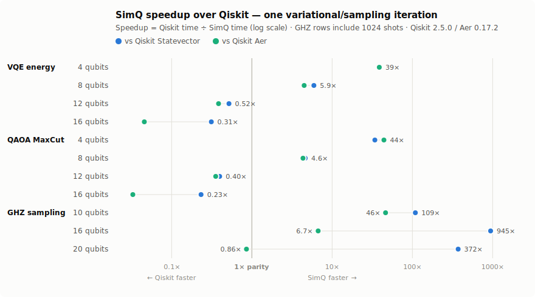

# Ferriq Benchmarks

Reproducible, cross-validated comparison of Ferriq against Qiskit on the
workloads Ferriq is built for: variational-algorithm inner loops (VQE, QAOA)
and circuit sampling.

**TL;DR (measured, not marketing):** Ferriq's advantage is per-iteration
overhead. In the regime where variational algorithms actually spend their
iterations — small-to-medium circuits evaluated thousands of times — Ferriq
is **4–45× faster than Qiskit** (both `Statevector` and Aer), and up to
**~950× faster** for shot sampling against pure-Python `Statevector`
sampling. Above ~12 qubits the picture reverses: **Qiskit Aer's C++
kernels are currently faster than Ferriq** (up to ~30× at 16 qubits). The
gate-kernel scaling gap is tracked in
[#76](https://github.com/glanzz/ferriq/issues/76). We publish both sides of
this chart on purpose.

<picture>
  <source media="(prefers-color-scheme: dark)" srcset="benchmarks/results/2026-07-08/chart-dark.svg">
  
</picture>

## Reproduce it in one command

```bash
git clone https://github.com/glanzz/ferriq.git && cd ferriq
./benchmarks/run.sh
```

The script creates a venv with the pinned Qiskit version
(`benchmarks/requirements.txt`), **cross-validates that both suites
simulate identical circuits** (12 expectation values compared to 12
decimal places), runs `cargo bench -p ferriq` and the Qiskit baseline on
your machine, and writes the merged table, charts, and raw JSON to
`benchmarks/results/<date>/`.

Pieces, if you'd rather run them yourself:

```bash
cargo bench -p ferriq --bench end_to_end          # Ferriq side (criterion)
pip install -r benchmarks/requirements.txt
python benchmarks/qiskit_baseline.py            # Qiskit side
python benchmarks/compare.py --skip-rust --skip-qiskit --out-dir ...  # merge/report
```

## Results

Environment for the published numbers (2026-07-08):

| | |
|---|---|
| CPU | Intel Xeon @ 2.10 GHz, 4 vCPUs (cloud container) |
| RAM | 15 GiB |
| OS | Linux 6.18 (x86_64) |
| Rust | rustc 1.94.1, `--release` with fat LTO (workspace default) |
| Ferriq | this repository, commit the results were published with |
| Python | 3.11.15 |
| Qiskit | **2.5.0**, qiskit-aer **0.17.2** |

Time per iteration (lower is better). One iteration always includes
circuit **construction + simulation**, because that is what a variational
optimizer does on every step:

| Workload | Ferriq | Qiskit Statevector | Qiskit Aer | vs Statevector | vs Aer |
|---|---|---|---|---|---|
| `vqe_energy/4q` | 0.047 ms | 1.770 ms | 1.801 ms | **38.1× faster** | **38.7× faster** |
| `vqe_energy/8q` | 0.652 ms | 3.867 ms | 2.924 ms | **5.9× faster** | **4.5× faster** |
| `vqe_energy/12q` | 14.700 ms | 7.622 ms | 5.652 ms | 1.9× slower | 2.6× slower |
| `vqe_energy/16q` | 385.322 ms | 120.392 ms | 17.611 ms | 3.2× slower | 21.9× slower |
| `qaoa_maxcut/4q` | 0.033 ms | 1.127 ms | 1.462 ms | **34.1× faster** | **44.3× faster** |
| `qaoa_maxcut/8q` | 0.511 ms | 2.361 ms | 2.221 ms | **4.6× faster** | **4.3× faster** |
| `qaoa_maxcut/12q` | 11.649 ms | 4.628 ms | 4.131 ms | 2.5× slower | 2.8× slower |
| `qaoa_maxcut/16q` | 310.474 ms | 72.244 ms | 10.214 ms | 4.3× slower | 30.4× slower |
| `ghz_sampling/10q` | 0.045 ms | 4.926 ms | 2.097 ms | **109.0× faster** | **46.4× faster** |
| `ghz_sampling/16q` | 0.671 ms | 634.268 ms | 4.497 ms | **944.7× faster** | **6.7× faster** |
| `ghz_sampling/20q` | 42.692 ms | 15.88 s | 36.562 ms | **372.0× faster** | 1.2× slower |

Raw data: [`benchmarks/results/2026-07-08/results.json`](benchmarks/results/2026-07-08/results.json).

### How to read this

- **Small circuits (≤ ~10 qubits) are where variational loops live**, and
  where Ferriq wins by a wide margin: a VQE run is thousands of
  build-simulate-measure iterations, and Python-side circuit construction
  plus framework dispatch dominates when each simulation is microseconds.
  Ferriq's whole pipeline is compiled, so a 4-qubit energy evaluation costs
  47 µs instead of ~1.8 ms.
- **At 12–16 qubits the state-vector kernels dominate**, and Qiskit Aer's
  mature C++ SIMD kernels currently beat Ferriq's — by 2.6× at 12 qubits and
  ~22–30× at 16. This is an honest, known gap in Ferriq's gate-application
  scaling, tracked with profiling data in
  [#76](https://github.com/glanzz/ferriq/issues/76). If your workload is
  large-circuit statevector crunching, use Aer today.
- **Qiskit `Statevector` vs Aer**: `qiskit.quantum_info.Statevector` is
  what most tutorials and quick scripts use; Aer is the optimized backend.
  We show both so neither side gets a strawman.

## Exact workload definitions

Every workload is implemented twice — `ferriq/benches/end_to_end.rs` (Rust,
criterion) and `benchmarks/qiskit_baseline.py` (Python) — from the shared
definition below. `benchmarks/compare.py` refuses to report before
verifying both implementations produce **identical expectation values**
(also runnable standalone: `cargo run --release -p ferriq --example
xcheck_bench`).

**Parameter schedule** (shared): evaluation `e`, parameter slot `j`:
`θ = (2·((131·e + 31·j) mod 1000)/1000 − 1)·π`. These are generic angles,
chosen deliberately so Ferriq's compile-time caches for common angles
(π/4, π/2, …) do **not** kick in — the comparison measures the
runtime-computation path, not a cache sweet spot.

**`vqe_energy/{4,8,12,16}q`** — one VQE energy evaluation:
- Ansatz: 3 layers of [RY(θ) on every qubit, RZ(θ) on every qubit,
  CNOT(i, i+1) chain] — a standard hardware-efficient ansatz.
- Observable: transverse-field Ising, `H = Σᵢ ZᵢZᵢ₊₁ + 0.5·Σᵢ Xᵢ`.
- One iteration = build circuit with fresh parameters → exact statevector
  simulation → exact ⟨H⟩.

**`qaoa_maxcut/{4,8,12,16}q`** — one QAOA cost evaluation:
- Circuit: H on all qubits, then p = 2 layers of [RZZ(γ) on every ring
  edge (i, (i+1) mod n), RX(β) on every qubit].
- Observable: MaxCut cost on the ring, `C = Σ₍ᵢ,ⱼ₎ (I − ZᵢZⱼ)/2`.

**`ghz_sampling/{10,16,20}q`** — GHZ state preparation (H + CNOT chain)
plus **1024 measurement shots**.

## Methodology and fairness notes

- **Timers**: Ferriq numbers are criterion's mean estimate
  (`cargo bench`, warmup + ~100 samples). Qiskit numbers are the median
  over 5 batches of the mean per-iteration wall time, with warmup, batch
  size auto-scaled to ≥ 0.4 s (`benchmarks/qiskit_baseline.py`).
- **Both frameworks may use all cores.** Nothing is pinned to one thread;
  Aer's own threading defaults are left untouched.
- **Aer is given its fast path**: circuits use only gates Aer executes
  natively, observables go through `save_expectation_value`, and **no
  transpilation step is included** for Aer, even though real users
  usually pay one.
- **Semantics are identical**: exact statevector simulation and exact
  (non-sampled) expectation values on all three engines; sampling
  workloads draw the same 1024 shots.
- Numbers move with hardware — absolute times on your machine will
  differ; the crossover point (~10–12 qubits on this box) can shift a
  size in either direction. Run `./benchmarks/run.sh` and see.

## History

| Date | Environment | Qiskit | Data |
|---|---|---|---|
| 2026-07-08 | Xeon 2.10 GHz, 4 vCPU, Linux 6.18 | 2.5.0 / Aer 0.17.2 | [`results.json`](benchmarks/results/2026-07-08/results.json) |
