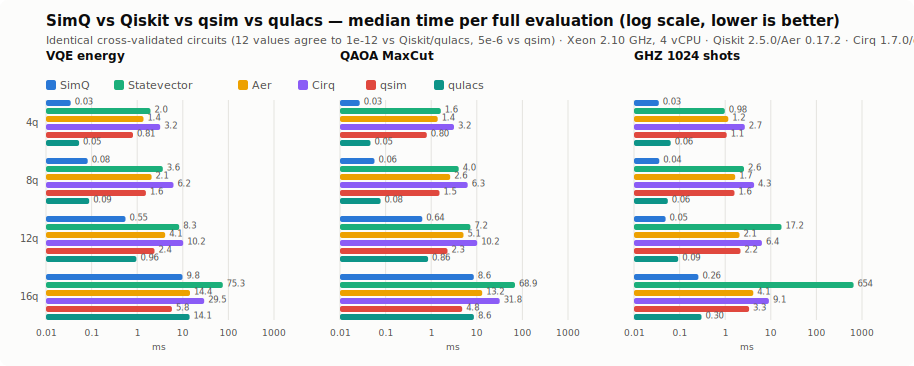

# SimQ - High-Performance Quantum Computing SDK

[](https://coveralls.io/github/glanzz/simq?branch=main)
[](https://crates.io/crates/simq)
[](https://docs.rs/simq)
[](https://glanzz.github.io/simq/)
[](LICENSE)

SimQ is a quantum computing SDK in Rust, built for speed without giving up type safety or an ergonomic API.

## Benchmarks

Every number below comes from a cross-validated suite: SimQ's output is checked against Qiskit (to 1e-12), qsim (to 5e-6), and qulacs (to 1e-12) on identical circuits before any timing is trusted. Full methodology, all 20 workloads, and the one documented loss are in [BENCHMARKS.md](BENCHMARKS.md); `./benchmarks/run.sh` reproduces it.

<picture>
  <source media="(prefers-color-scheme: dark)" srcset="benchmarks/results-dark.svg">
  
</picture>

*4-16 qubits, VQE / QAOA / GHZ sampling. SimQ beats Qiskit Aer on 19 of 20 workloads in the full suite (1.5-72.6x) and exact Statevector on all 20 (2.7-2534x). The strongest competitor found is [qulacs](https://github.com/qulacs/qulacs); SimQ still leads it on every covered workload, by 1.0-1.9x.*

<picture>
  <source media="(prefers-color-scheme: dark)" srcset="benchmarks/results-scaling-dark.svg">
  
</picture>

*Same machine, pushed to the edge: 20-30 qubits. SimQ still leads at 28 qubits (4 GiB state), and every simulator hits the same wall at 30: a dense statevector needs 16 GiB, more than the 15 GiB box has. That's physics, not a bug: SimQ fails cleanly with a clear error instead of aborting.*

This isn't cherry-picked. The suite also loses one workload (deep QFT at 16 qubits, where the gate structure is long-range and SimQ's fusion pass is local), and BENCHMARKS.md documents that loss and why it happens, not just the wins.

## Quick Start

```toml
[dependencies]
simq = "0.1"
```

```rust
use simq::QuantumCircuit;

fn main() {
    // Create a 3-qubit GHZ circuit
    let mut qc = QuantumCircuit::new(3);
    qc.h(0)          // Hadamard on qubit 0
        .cnot(0, 1)  // CNOT: control=0, target=1
        .cnot(1, 2); // CNOT: control=1, target=2

    // Simulate with 1024 measurement shots
    let result = qc.simulate_with_shots(1024).unwrap();
    let counts = result.measurements.unwrap();
    println!("Results: {:?}", counts.sorted());
    // e.g. [("000", 517), ("111", 507)]
}
```

Gate methods chain fluently and never panic: the first invalid operation
(e.g. an out-of-range qubit) is recorded and returned as an error from
`build()` or `simulate()`. The full standard gate set is available:
`h`, `x`, `y`, `z`, `s`, `t`, `sx` (and daggers), `rx`, `ry`, `rz`, `p`,
`u1`/`u2`/`u3`, `cnot`/`cx`, `cy`, `cz`, `cp`, `swap`, `iswap`, `ecr`,
`rxx`/`ryy`/`rzz`, `toffoli`/`ccx`, `cswap`, plus a `gate(...)` escape
hatch for custom gates.

For lower-level control, the subcrate APIs are available through the same dependency:

```rust
use simq::prelude::*;

fn main() -> Result<(), Box<dyn std::error::Error>> {
    let mut circuit = Circuit::new(2);
    circuit.add_gate(Arc::new(Hadamard), &[QubitId::new(0)])?;
    circuit.add_gate(Arc::new(CNot), &[QubitId::new(0), QubitId::new(1)])?;

    let result = Simulator::new(SimulatorConfig::default()).run(&circuit)?;
    println!("Final state has {} qubits", result.num_qubits());
    Ok(())
}
```

VQE energy functions are a few lines, since exact expectation values are one call away:

```rust
use simq::{PauliObservable, PauliString, QuantumCircuit};

let hamiltonian = PauliObservable::from_pauli_string(
    PauliString::from_str("Z").unwrap(), 1.0);

let energy = |theta: f64| {
    let mut qc = QuantumCircuit::new(1);
    qc.ry(theta, 0);
    qc.expectation_value(&hamiltonian).unwrap()
};
// energy(θ) = cos(θ); minimize with your favourite optimizer
```

Run `cargo run -p simq --example vqe_fluent` for a complete gradient-descent
VQE loop, and see `simq-sim/examples/` for full workflows with the built-in
optimizers and gradient methods (`vqe_h2_molecule`, `qaoa_maxcut`, ...).

## Why SimQ

- **Measured, not claimed, performance**: see Benchmarks above; every number is reproducible with `./benchmarks/run.sh`.
- **Type-safe by construction**: the const-generic `CircuitBuilder<N>` catches an out-of-range qubit at the call site, not at runtime:
  ```rust
  let mut builder = simq::prelude::CircuitBuilder::<4>::new();
  builder.qubit(5).unwrap_err(); // qubit 5 doesn't exist, caught immediately
  ```
- **Memory-aware, not just memory-efficient**: a hybrid sparse/dense state representation, and `Simulator::run` derives its qubit cap from actual available memory (`16 x 2^n` bytes per state), refusing an oversized circuit cleanly instead of aborting. Measured cap: 29 qubits on 15 GiB of RAM (see BENCHMARKS.md).
- **Hardware ready**: the same circuit code runs on the simulator or against IBM Quantum / AWS Braket backends.
- **Built-in gradients**: automatic gradient computation for VQE/QAOA-style variational algorithms.
- **Compile-time gate matrix caching**: common rotation angles resolve in 0-5ns instead of computing a matrix at runtime; see [`simq-gates/COMPILE_TIME_CACHING.md`](simq-gates/COMPILE_TIME_CACHING.md) for the full design and its accuracy guarantee (cache hits are exact-match only, to 1e-12; never approximated).

## Architecture

- **simq**: Umbrella crate, the fluent `QuantumCircuit` builder plus re-exports of everything below
- **simq-core**: Core types and traits
- **simq-state**: Quantum state representations (sparse/dense)
- **simq-gates**: Gate library with SIMD optimizations and compile-time caching
- **simq-macros**: Procedural macros for compile-time code generation
- **simq-compiler**: Circuit optimization passes
- **simq-sim**: High-performance simulator
- **simq-backend**: Hardware backend abstraction

## Documentation

The full documentation lives at **[glanzz.github.io/simq](https://glanzz.github.io/simq/)**:

| Section | What's there |
|---------|--------------|
| [Installation](https://glanzz.github.io/simq/getting-started/installation.html) | Rust crate setup and Python bindings via maturin |
| [Quickstart (Rust)](https://glanzz.github.io/simq/getting-started/quickstart-rust.html) | Your first circuit in five minutes |
| [Quickstart (Python)](https://glanzz.github.io/simq/getting-started/quickstart-python.html) | The Python API tour |
| [User guide](https://glanzz.github.io/simq/guide/circuits.html) | Circuits, simulation, VQE/QAOA, compiler, noise, backends |
| [Examples](https://glanzz.github.io/simq/examples/) | Every runnable example in the workspace, catalogued |
| [Architecture](https://glanzz.github.io/simq/architecture/) | How the eight crates fit together |
| [Contributing](https://glanzz.github.io/simq/contributing/) | Dev setup, testing, and the PR workflow |

Rust API reference: [docs.rs/simq](https://docs.rs/simq) (or `cargo doc --workspace --exclude simq-py --no-deps --open` locally).

## Contributing

We welcome contributions! Please see the [contributing guide](https://glanzz.github.io/simq/contributing/) for development setup, coding standards, and the PR workflow.

### Development Setup

```bash
# Clone the repository
cd simq

# Build the project
cargo build

# Run tests
cargo test

# Run benchmarks
cargo bench

# Reproduce the full cross-validated SimQ vs Qiskit/qsim/qulacs comparison (see BENCHMARKS.md)
./benchmarks/run.sh

# Format code
cargo fmt

# Run linter
cargo clippy

# Build the documentation site (output in docs/build/html)
pip install -r docs/requirements.txt
make -C docs html
```

## License

Licensed under either of:

- Apache License, Version 2.0 ([LICENSE-APACHE](LICENSE-APACHE) or http://www.apache.org/licenses/LICENSE-2.0)
- MIT license ([LICENSE-MIT](LICENSE-MIT) or http://opensource.org/licenses/MIT)

at your option.

## Acknowledgments

SimQ is inspired by:

- [Qiskit](https://qiskit.org/) - Python quantum computing framework
- [Cirq](https://quantumai.google/cirq) - Google's quantum framework
- [Q#](https://azure.microsoft.com/en-us/products/quantum/) - Microsoft's quantum language
- [QuEST](https://quest.qtechtheory.org/) - Quantum Exact Simulation Toolkit

## Citation

If you use SimQ in your research, please cite:

```bibtex
@software{simq2024,
  title = {SimQ: High-Performance Quantum Computing SDK in Rust},
  author = {SimQ Contributors},
  year = {2024},
  url = {https://github.com/glanzz/simq}
}
```
