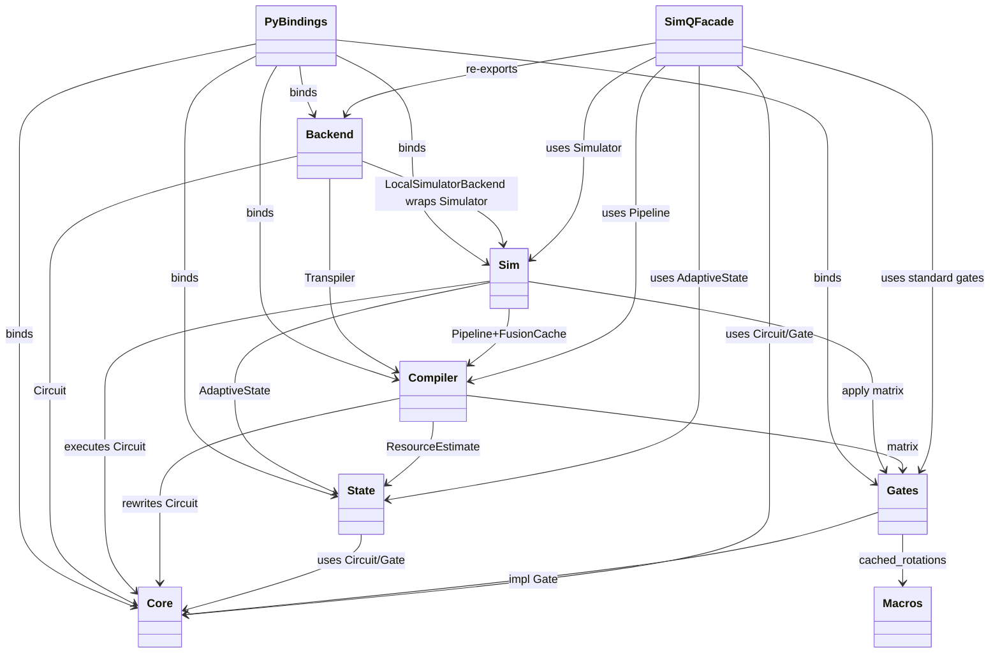
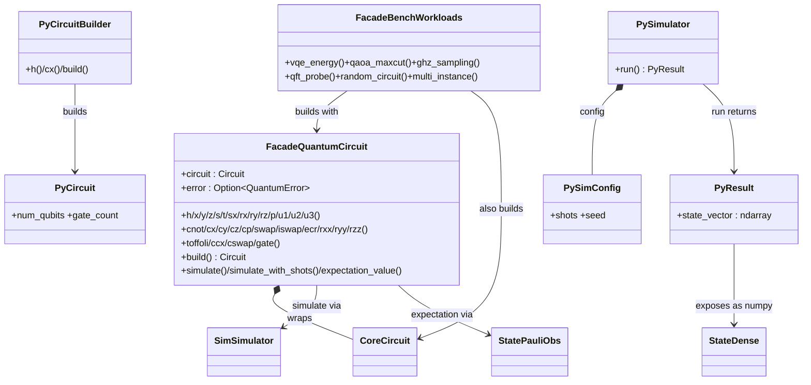

# SimQ UML — Classes and Relations

> Source: `simq-core`, `simq-gates`, `simq-state`, `simq-compiler`, `simq-sim`, `simq-backend`, `simq`, `simq-macros`, `simq-py`
> Render with: GitHub markdown, `mermaid.live`, or `docs/source/architecture/index.md` (MyST `{mermaid}`).
> Legend: `<<trait>>` = Rust trait, `<<enum>>` = Rust enum, plain = `struct`/`type`. `-->` dependency/uses, `*--` composition (owns), `o--` aggregation (holds Arc/ref), `--|>` inheritance, `..|>` trait implementation.

---

## 1. Package / Crate Overview

| Crate | Role | Entry types |
|---|---|---|
| `simq-core` | types, builders, noise, validation, renderers | `Gate`, `GateOp`, `Circuit`, `CircuitBuilder<N>`, `QubitId` |
| `simq-gates` | gate library + matrix caches | `Hadamard…Toffoli`, `CustomGate`, `GateRegistry`, `UniversalCache` |
| `simq-state` | sparse/dense/adaptive states, measurement, observables | `DenseState`, `SparseState`, `AdaptiveState`, `PauliObservable` |
| `simq-compiler` | optimization pipeline, fusion, decomposition, e-graph | `Compiler`, `OptimizationPass`, `FusedGate`, `UniversalDecomposer` |
| `simq-sim` | statevector engine, gradients, VQE/QAOA, stabilizer/MPS/Pauli-prop | `Simulator`, `SimulatorConfig`, `SimulationResult` |
| `simq-backend` | hardware abstraction, transpiler, SABRE routing | `QuantumBackend`, `Transpiler`, `SabreRouter` |
| `simq` | fluent facade `QuantumCircuit` + re-exports + bench workloads | `QuantumCircuit` |
| `simq-macros` | proc-macros generating rotation caches | `cached_rotations!`, `cache_rotation_range!` |
| `simq-py` | PyO3 `import simq` bindings | `CircuitBuilder`, `Simulator` (Python) |

---

## 2. `simq-core` — Foundation

```mermaid
classDiagram
  direction TB
  class CoreGate {
    <<trait>>
    +name() str
    +num_qubits() int
    +matrix() Option
    +is_hermitian() bool
  }
  class CoreDiagonalGate {
    <<trait>>
    +diagonal() Vec
  }
  class CoreGateOp {
    +gate : Arc~Gate~
    +qubits : SmallVec
  }
  class CoreCircuit {
    +num_qubits : int
    +ops : Vec~GateOp~
    +add_gate() Result
    +len()/depth()/to_ascii()
  }
  class CoreCircuitBuilder {
    +build() Circuit
    +qubit(i) Qubit~N~
  }
  class CoreDynamicBuilder {
    +add_gate() Result
    +build() Circuit
  }
  class CoreQubitId { +id : usize }
  class CoreQubit { +id : QubitId }
  class CoreParameter { +value + constraints }
  class CoreParameterId { +id : u32 }
  class CoreParameterRegistry { +bind()/resolve() }
  class CoreQuantumError {
    <<enum>>
    +OutOfRange +InvalidGate +TooManyQubits +Serialization
  }
  class CoreValidationRule {
    <<trait>>
    +check(Circuit) ValidationResult
  }
  class CoreValidationReport { +errors + warnings }
  class CoreValidationResult { +is_valid : bool }
  class CoreDependencyGraph { +layers }
  class CoreCycleRule
  class CoreDependencyRule
  class CoreQubitUsageRule
  class CoreNoiseChannel {
    <<trait>>
    +kraus_ops() Vec
  }
  class CoreNoiseModel { +channels : Vec }
  class CoreDepolarizing { +p : f64 }
  class CoreAmplitudeDamping { +gamma : f64 }
  class CorePhaseDamping { +lambda : f64 }
  class CoreReadoutError { +p0 : f64 +p1 : f64 }
  class CoreKrausOperator { +matrices : Vec }
  class CoreHardwareNoise { +qubit_props +gate_noise }
  class CoreQubitProps { +t1 +t2 +readout_fidelity }
  class CoreTwoQProps { +fidelity +duration }
  class CoreCrosstalk { +strength_matrix }
  class CoreGateTiming { +durations : Map }
  class CoreQubitTracker { +idle_times : Vec }
  class CoreMonteCarloSampler {
    <<trait>>
    +sample() PauliOperation
  }
  class CoreAsciiConfig { +style : RenderStyle }
  class CoreRenderedCircuit { +lines : Vec~str~ }
  class CoreLatexConfig { +packages : Vec }
  class CoreBlochVector { +x+y+z }
  class CoreBlochAngles { +theta +phi }
  class CoreCircuitDebugger { +step() StepInfo }
  class CoreStepInfo { +gate_index +state_label }
  class CoreStatefulDebugger { +snapshots : Vec }
  class CoreStateSnapshot { +amplitudes : Vec }
  class CoreAmplitudeEntry { +basis +amp }
  class CoreSerializedCircuit { +num_qubits +ops }
  class CoreCircuitMetadata { +version +backend }

  CoreDiagonalGate --|> CoreGate : extends
  CoreGateOp *-- CoreGate : gate
  CoreGateOp *-- CoreQubitId : qubits
  CoreCircuit *-- CoreGateOp : ops
  CoreCircuitBuilder --> CoreQubit : creates
  CoreCircuitBuilder --> CoreCircuit : builds
  CoreDynamicBuilder --> CoreCircuit : builds
  CoreQubit *-- CoreQubitId
  CoreParameter *-- CoreParameterId
  CoreParameterRegistry *-- CoreParameter
  CoreParameterRegistry *-- CoreParameterId
  CoreDepolarizing ..|> CoreNoiseChannel
  CoreAmplitudeDamping ..|> CoreNoiseChannel
  CorePhaseDamping ..|> CoreNoiseChannel
  CoreReadoutError ..|> CoreNoiseChannel
  CoreKrausOperator ..|> CoreNoiseChannel
  CoreNoiseModel o-- CoreNoiseChannel : channels
  CoreHardwareNoise o-- CoreKrausOperator : gate_noise
  CoreHardwareNoise *-- CoreQubitProps : qubit_props
  CoreHardwareNoise *-- CoreTwoQProps : twoq_props
  CoreHardwareNoise *-- CoreCrosstalk
  CoreHardwareNoise *-- CoreGateTiming
  CoreCycleRule ..|> CoreValidationRule
  CoreDependencyRule ..|> CoreValidationRule
  CoreQubitUsageRule ..|> CoreValidationRule
  CoreValidationRule --> CoreValidationResult : returns
  CoreValidationReport *-- CoreValidationResult
  CoreDependencyGraph --> CoreCircuit : analyzes
  CoreCircuitDebugger --> CoreCircuit : debugs
  CoreStatefulDebugger --> CoreStateSnapshot : collects
  CoreStateSnapshot *-- CoreAmplitudeEntry : entries
  CoreSerializedCircuit --> CoreCircuit : from/to
  CoreMonteCarloSampler --> CoreNoiseModel : samples
```

---

## 3. `simq-gates` (+ `simq-macros` generators)

```mermaid
classDiagram
  direction TB
  class GatesHadamard
  class GatesPauliX
  class GatesPauliY
  class GatesPauliZ
  class GatesIdentity
  class GatesSGate
  class GatesSGateDagger
  class GatesTGate
  class GatesTGateDagger
  class GatesSXGate
  class GatesSXDagger
  class GatesCNot
  class GatesCZ
  class GatesCY
  class GatesCH
  class GatesSwap
  class GatesISwap
  class GatesECR
  class GatesToffoli
  class GatesFredkin
  class GatesRotationX { +theta : f64 }
  class GatesRotationY { +theta : f64 }
  class GatesRotationZ { +theta : f64 }
  class GatesPhase { +lambda : f64 }
  class GatesU1 { +lambda : f64 }
  class GatesU2 { +phi +lambda }
  class GatesU3 { +theta+phi+lambda }
  class GatesCPhase { +theta : f64 }
  class GatesRXX { +theta : f64 }
  class GatesRYY { +theta : f64 }
  class GatesRZZ { +theta : f64 }
  class GatesRZX { +theta : f64 }
  class GatesCRX { +theta : f64 }
  class GatesCRY { +theta : f64 }
  class GatesCRZ { +theta : f64 }
  class GatesCustomGate { +matrix : Array2 }
  class GatesCustomBuilder { +build() CustomGate }
  class GatesParamGate { +matrix_fn : MatrixFn }
  class GatesParamBuilder { +bind() ParamGate }
  class GatesRegistry { +register()/get() GateInfo }
  class GatesGateInfo { +name +num_qubits }
  class GatesCommonAngles
  class GatesVQEAngles
  class GatesUniversalCache { +lookup() }
  class GatesGeneratedCache
  class GatesEnhancedCache
  class GatesLookupConfig { +tolerance : f64 }
  class GatesRotTable { +angles +sincos }
  class GatesOptRX { +table : SharedTable }
  class GatesOptRY { +table : SharedTable }
  class GatesOptRZ { +table : SharedTable }
  class MacrosCacheMacro {
    <<macro>>
    +cached_rotations!()
    +cache_rotation_range!()
  }

  GatesHadamard ..|> CoreGate : impl
  GatesPauliX ..|> CoreGate : impl
  GatesPauliY ..|> CoreGate : impl
  GatesPauliZ ..|> CoreGate : impl
  GatesRotationX ..|> CoreGate : impl
  GatesRotationY ..|> CoreGate : impl
  GatesRotationZ ..|> CoreGate : impl
  GatesCNot ..|> CoreGate : impl
  GatesToffoli ..|> CoreGate : impl
  GatesCustomGate ..|> CoreGate : impl
  GatesParamGate ..|> CoreGate : impl
  GatesCustomBuilder --> GatesCustomGate : creates
  GatesParamBuilder --> GatesParamGate : creates
  GatesRegistry o-- CoreGate : Arc dyn
  GatesRegistry *-- GatesGateInfo : infos
  GatesVQEAngles --|> GatesCommonAngles : specialization
  GatesGeneratedCache --|> GatesUniversalCache : generated
  GatesEnhancedCache --|> GatesUniversalCache : enhanced
  GatesRotTable --> GatesOptRX : shared
  GatesRotTable --> GatesOptRY : shared
  GatesRotTable --> GatesOptRZ : shared
  MacrosCacheMacro --> GatesUniversalCache : generates
  MacrosCacheMacro --> GatesGeneratedCache : generates
```

---

## 4. `simq-state` — States, Measurement, Observables

```mermaid
classDiagram
  direction TB
  class StateDense { +amps : Vec~Complex~ +apply_single/diagonal() }
  class StateVector { +to_dense_vec() }
  class StateSparse { +map : HashMap~u64,Complex~ +density()/to_dense() }
  class StateAdaptive {
    <<enum>>
    +Sparse +Dense +stats
  }
  class StateStats { +conversions +density }
  class StateCow { +inner : Cow~Adaptive~ }
  class StateCowStats { +clones +copy_on_write }
  class StateFP32 { +amps32 : Vec }
  class StateDensityMatrix { +rho : Array2 }
  class StateDensityConfig { +noise : NoiseModel }
  class StateDensitySim { +run() rho }
  class StateSimStats { +steps +purity }
  class StateMCConfig { +trajectories : int }
  class StateMCSim { +run() avg_rho }
  class StateMCStats { +variance +shots }
  class StateMeasurement {
    <<trait>>
    +sample(state,shots) counts
  }
  class StateMeasureResult { +counts : Map }
  class StateSamplingResult { +bitstrings : Vec }
  class StateCompBasis { +collapse : bool +sample() }
  class StateAliasTable { +prob +alias }
  class StateMidCircuit { +qubit +outcome }
  class StatePauli {
    <<enum>>
    +I+X+Y+Z
  }
  class StatePauliString { +paulis : Vec +from_str() }
  class StatePauliObs { +terms : Vec +expectation() }
  class StateError {
    <<enum>>
    +DimensionMismatch +NotNormalized +TooLarge
  }
  class StateValidPolicy {
    <<enum>>
    +Strict +Relaxed +Disabled
  }

  StateVector --|> StateDense : wrapper
  StateCow o-- StateAdaptive : Cow inner
  StateAdaptive o-- StateDense : Dense variant
  StateAdaptive o-- StateSparse : Sparse variant
  StateAdaptive *-- StateStats : stats
  StateDensitySim *-- StateDensityMatrix : evolves
  StateDensitySim *-- StateDensityConfig : config
  StateDensitySim *-- StateSimStats : stats
  StateMCSim *-- StateMCConfig : config
  StateMCSim *-- StateMCStats : stats
  StateCompBasis ..|> StateMeasurement
  StateCompBasis --> StateAliasTable : builds compacted
  StateCompBasis --> StateMeasureResult : returns
  StateCompBasis --> StateSamplingResult : returns
  StateMidCircuit --> StateCompBasis : uses
  StatePauliString *-- StatePauli : paulis
  StatePauliObs *-- StatePauliString : terms
  StatePauliObs --> StateDense : expectation_value()
```

Key relation: `AdaptiveState` auto-converts `Sparse -> Dense` at `~1/1024` density; `ComputationalBasis::sample` compacts `p > 1e-14` before `AliasTable::new` so cost scales with support, not `2^n`.

---

## 5. `simq-compiler` — Pipeline, Passes, Fusion, Decomposition

```mermaid
classDiagram
  direction TB
  class CompOptPass {
    <<trait>>
    +name() str
    +run(Circuit) OptimizationResult
  }
  class CompPassStats { +gates_removed +gates_fused }
  class CompOptResult { +changed : bool +stats }
  class CompCompiler { +passes : Vec +compile() }
  class CompCompilerConfig { +max_iterations : int }
  class CompCompilerBuilder { +add_pass() +build() }
  class CompPipelineBuilder { +O0()/O2()/O3()/egraph() }
  class CompOptLevel {
    <<enum>>
    +O0+O1+O2+O3
  }
  class CompCachedCompiler { +cache : CompilationCache }
  class CompSharedCompiler { +inner : Arc~Cached~ }
  class CompFingerprint { +hash : u64 }
  class CompCacheStats { +hits +misses }
  class CompFusionConfig { +max_width +threshold_qubits +long_range }
  class CompFusedGate { +matrix +qubits }
  class CompGateFusion { +fuse() }
  class CompFusionCache { +get/put(block_structure) }
  class CompDCE { +eliminate() }
  class CompCommutation { +commute() }
  class CompTemplateSub { +rewrite() }
  class CompTemplateMatch { +match() }
  class CompEqSat { +optimize_chain() }
  class CompGateLang { +Seq +Gate }
  class CompDecomposer { +decompose() BasisGate }
  class CompBasisSet {
    <<enum>>
    +IBM+Google+IonQ+Custom
  }
  class CompBasisGate {
    <<enum>>
    +H+CX+RZ+SX+...
  }
  class CompSingleDecomp { +decompose_zyz() EulerAngles }
  class CompEulerAngles { +theta+phi+lambda }
  class CompTwoQDecomp { +canonical() Canonical }
  class CompCanonical { +kx+ky+kz }
  class CompMultiQDecomp { +decompose() }
  class CompCliffordT { +gridsynth() }
  class CompHardwareModel {
    <<trait>>
    +circuit_cost() f64
  }
  class CompIBMHW { +coupling_map }
  class CompGoogleHW { +sycamore_graph }
  class CompIonQHW { +all_to_all }
  class CompCostModel { +gate_costs : Map }
  class CompAnalysis { +gate_stats() +resources() }
  class CompGateStats { +counts_by_type : Map }
  class CompResources { +depth +twoq_count }
  class CompExecPlanner { +plan() ExecutionPlan }
  class CompExecPlan { +layers : Vec }
  class CompExecLayer { +parallel_gates : Vec }
  class CompLazyGate { +deferred_matrix }
  class CompLazyExec { +flush() }
  class CompMatrixCache { +get() FlatMatrix }

  CompCompiler *-- CompOptPass : passes
  CompCompiler *-- CompCompilerConfig : config
  CompCompilerBuilder o-- CompOptPass : add_pass
  CompCompilerBuilder --> CompCompiler : builds
  CompPipelineBuilder --> CompCompiler : O-level preset
  CompCachedCompiler o-- CompFingerprint : key
  CompCachedCompiler *-- CompCacheStats : stats
  CompSharedCompiler o-- CompCachedCompiler : Arc
  CompGateFusion ..|> CompOptPass
  CompDCE ..|> CompOptPass
  CompCommutation ..|> CompOptPass
  CompTemplateSub ..|> CompOptPass
  CompTemplateMatch ..|> CompOptPass
  CompEqSat ..|> CompOptPass
  CompEqSat --> CompGateLang : egg language
  CompGateFusion --> CompFusedGate : creates
  CompGateFusion --> CompFusionCache : memoizes structure only
  CompFusedGate ..|> CoreGate : impl
  CompSingleDecomp --> CompEulerAngles : returns
  CompTwoQDecomp --> CompCanonical : returns
  CompDecomposer o-- CompBasisSet : target
  CompDecomposer --> CompBasisGate : emits
  CompIBMHW ..|> CompHardwareModel
  CompGoogleHW ..|> CompHardwareModel
  CompIonQHW ..|> CompHardwareModel
  CompCostModel --> CompHardwareModel : evaluates
  CompAnalysis --> CompGateStats : collects
  CompAnalysis --> CompResources : estimates
  CompExecPlanner --> CompExecPlan : builds
  CompExecPlan *-- CompExecLayer : layers
  CompLazyExec o-- CompLazyGate : queue
  CompLazyExec o-- CompMatrixCache : memo
```

`FusionStructureCache` keys on structural fingerprint (qubit indices + gate names, **no angles**); matrices always recomputed → exact across VQE parameter sweeps.

---

## 6. `simq-sim` — Engine, Gradients, Alternative Backends

```mermaid
classDiagram
  direction TB
  class SimConfig {
    +sparse_threshold : f64
    +parallel_threshold : int
    +shots : int +seed
    +optimize_circuit : bool +opt_level
    +fusion_cache_size : int +memory_limit
    +validate()
  }
  class SimSimulator {
    +config : SimConfig
    +fusion_cache : Arc~FusionCache~
    +run(Circuit) SimulationResult
  }
  class SimResult { +state : AdaptiveState +measurements }
  class SimCounts { +counts : Map +sorted()/probability() }
  class SimError {
    <<enum>>
    +TooManyQubits +InvalidCircuit +MemoryExceeded +GpuNotAvailable
  }
  class SimStats { +gate_times +peak_memory }
  class SimExecutor { +execute() }
  class SimAdaptiveExec { +choose(serial/parallel) }
  class SimParallelExec { +par_blocks() rayon }
  class SimExecConfig { +block_size +mode }
  class SimGateMatrix { +data : GateMatrixData }
  class SimCheckpoint { +snapshot : Vec }
  class SimCheckpointMgr { +save()/restore() }
  class SimTelemetry { +metrics : ExecutionMetrics }
  class SimGradConfig { +method +epsilon +shots }
  class SimGradMethod {
    <<enum>>
    +ParameterShift+Adjoint+FiniteDiff+AutoDiff
  }
  class SimGradResult { +grads : Vec~f64~ }
  class SimDual { +value +deriv }
  class SimTape { +ops : Vec }
  class SimVQEConfig { +ansatz_depth +optimizer }
  class SimVQEOpt { +minimize() OptimizationResult }
  class SimQAOACfg { +p : int +graph }
  class SimQAOAOpt { +optimize() }
  class SimQAOABuilder { +cost_layer()+mixer() }
  class SimGraph { +nodes +edges }
  class SimBatchResult { +energies : Vec }
  class SimBatchConfig { +parallel : bool }
  class SimAdamConfig { +lr +beta1+beta2 }
  class SimConvergence { +check() ConvergenceStatus }
  class SimStabilizer { +tableau : Vec~Vec~bool~ +sample_bitstrings() }
  class SimMpsState { +tensors : Vec +bond_dim }
  class SimMpsConfig { +max_bond +cutoff }
  class SimPauliPropCfg { +truncation : f64 }
  class SimPauliPropRes { +energy : f64 +terms : int }
  class SimGpuCtx { +device +queue }

  SimSimulator *-- SimConfig : config
  SimSimulator o-- CompFusionCache : persistent fusion_cache
  SimSimulator --> SimResult : run returns
  SimSimulator --> SimExecutor : dispatches
  SimResult *-- StateAdaptive : state
  SimResult *-- SimCounts : measurements
  SimExecutor --> SimAdaptiveExec : delegates
  SimAdaptiveExec --> SimParallelExec : above threshold
  SimExecConfig --> SimExecutor : tunes
  SimCheckpointMgr *-- SimCheckpoint : manages
  SimTelemetry *-- SimStats : collects
  SimGradConfig *-- SimGradMethod : method
  SimVQEOpt --> SimGradResult : computes via
  SimQAOAOpt --> SimGradResult : computes via
  SimQAOABuilder *-- SimGraph : problem
  SimQAOABuilder --> CoreCircuit : builds
  SimBatchConfig --> SimBatchResult : run_batch
  SimAdamConfig --> SimVQEOpt : drives
  SimConvergence --> SimVQEOpt : monitors
  SimStabilizer --> SimCounts : sample_bitstrings
  SimMpsState *-- SimMpsConfig : config
  SimPauliPropCfg --> SimPauliPropRes : propagate
```

Alternative paths (`Stabilizer` Clifford-only O(n²), `MpsState` near-1D, Pauli-propagation Heisenberg) are explicit opt-ins, never auto-dispatched from `Simulator::run`.

---

## 7. `simq-backend` — Backends, Transpiler, Routing

```mermaid
classDiagram
  direction TB
  class BackBackend {
    <<trait>>
    +run(Circuit) BackendResult
    +capabilities() BackendCapabilities
  }
  class BackAsyncBackend {
    <<trait>>
    +run_async() Result
  }
  class BackType {
    <<enum>>
    +LocalSimulator+IBMQuantum+Braket+Azure
  }
  class BackCaps { +gate_set +connectivity +max_qubits }
  class BackGateSet { +native : Set~str~ }
  class BackConnectivity { +edges : Vec +distance() }
  class BackSelector { +select() Backend }
  class BackCriteria { +min_fidelity +max_cost }
  class BackFeature {
    <<enum>>
    +MidCircuitMeasure+PulseControl+ErrorMitigation
  }
  class BackTranspiler { +transpile() Circuit }
  class BackQubitMap { +logical_to_physical : Map }
  class BackSwapStrat {
    <<enum>>
    +Sabre+Greedy+Optimal
  }
  class BackCost { +swaps_added +depth_delta }
  class BackRouter { +route() Circuit }
  class BackSabre { +forward_backward() }
  class BackSwapGate { +q0+q1 }
  class BackRouteStats { +swaps +depth }
  class BackDecomposer { +decompose() Vec~GateOp~ }
  class BackResult { +counts +metadata }
  class BackMetadata { +shots +backend_name +duration }
  class BackJobStatus {
    <<enum>>
    +Queued+Running+Completed+Failed+Cancelled
  }
  class BackError {
    <<enum>>
    +ConnectionFailed+JobFailed+UnsupportedGate+TranspileFailed
  }
  class BackLocalCfg { +sim_config : SimulatorConfig }
  class BackLocalBackend { +sim : Simulator }
  class BackIBMConfig { +token +channel +instance }
  class BackIBMBackend { +client : HttpClient }

  BackAsyncBackend --|> BackBackend : extends
  BackLocalBackend ..|> BackBackend
  BackIBMBackend ..|> BackBackend
  BackBackend --> BackCaps : capabilities
  BackBackend --> BackResult : run returns
  BackCaps *-- BackGateSet : gate_set
  BackCaps *-- BackConnectivity : connectivity
  BackSelector --> BackCriteria : filters by
  BackSelector --> BackBackend : returns
  BackSelector --> BackFeature : requires
  BackTranspiler *-- BackQubitMap : mapping
  BackTranspiler *-- BackSwapStrat : strategy
  BackTranspiler --> BackCost : reports
  BackTranspiler --> BackRouter : calls
  BackTranspiler --> BackDecomposer : calls
  BackSabre --|> BackRouter : impl
  BackRouter --> BackSwapGate : inserts
  BackRouter --> BackRouteStats : reports
  BackResult *-- BackMetadata : metadata
  BackResult *-- BackJobStatus : status
  BackLocalBackend *-- BackLocalCfg : config
  BackLocalBackend *-- SimSimulator : sim
  BackIBMBackend *-- BackIBMConfig : config
```

---

## 8. `simq` Facade + `simq-py`

Deferred-error contract: `QuantumCircuit.gate()` records first `QuantumError`, later calls no-op, error surfaces at `build()/simulate()` — panic-free chaining (vs `CircuitBuilder<N>` which fails fast at call site).

---

## 9. Key Cross-Crate Relation Table

| From | To | Kind | Note |
|---|---|---|---|
| `GateOp` | `Gate` | `o--` holds `Arc<dyn Gate>` | dynamic dispatch, shared |
| `Circuit` | `GateOp` | `*--` owns `Vec` | Also `SmallVec<[QubitId;2]>` per op |
| `QuantumCircuit` | `Circuit` | `*--` wraps | + sticky `Option<QuantumError>` |
| `Simulator` | `SimulatorConfig` | `*--` owns | validated in `new()` |
| `Simulator` | `FusionStructureCache` | `o--` persistent `Arc` | survives across `run()` for VQE loops |
| `Compiler` | `OptimizationPass` | `*-- Vec<Arc<dyn>>` | fixed-point to `max_iterations` |
| `FusedGate` | `Gate` | `..|>` implements | embedded product matrix |
| `AdaptiveState` | `DenseState`/`SparseState` | variant owns | threshold `~1/1024` |
| `PauliObservable` | `PauliString` | `*--` terms | `expectation_value(&DenseState)` bitmask pass |
| `ComputationalBasis` | `AliasTable` | creates (compacted) | filters `p>1e-14` first |
| `LocalSimulatorBackend` | `Simulator` | `*--` wraps | `QuantumBackend` impl |
| `Transpiler` | `Router` + `GateDecomposer` | calls | SABRE + basis decomposition |
| `PySimulator` | `Simulator` | wraps | PyO3 + numpy statevector |
| `cached_rotations!` | `UniversalCache` | generates | const matrices, exact `1e-12` lookup |
