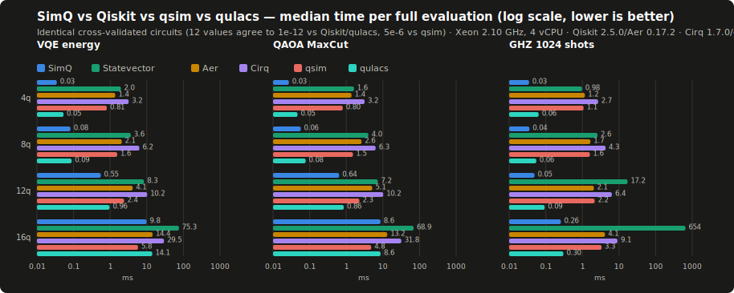
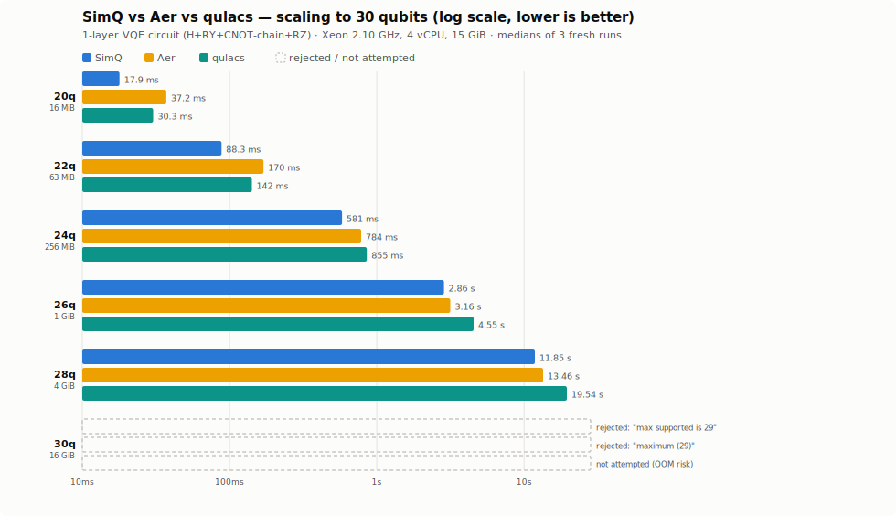
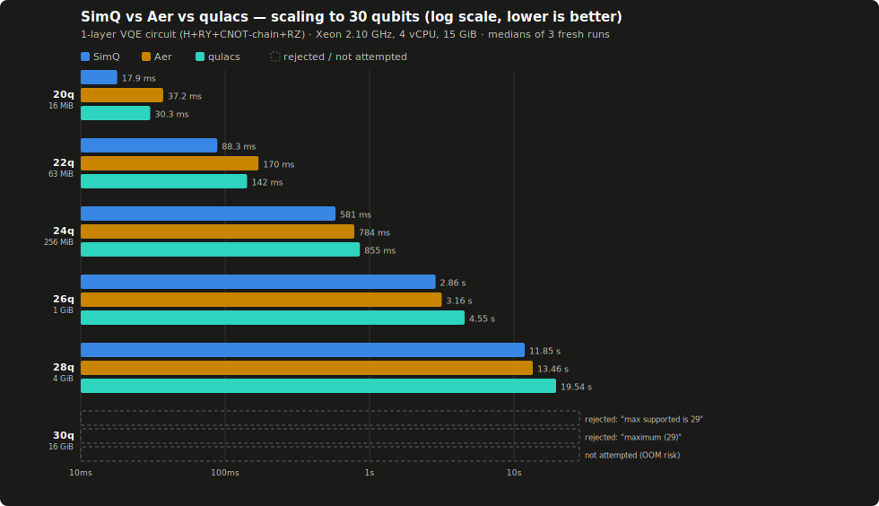

---
myst:
  html_meta:
    description: "SimQ is a high-performance quantum computing SDK written in Rust with Python bindings: cross-validated against Qiskit, qsim, and qulacs, beating Qiskit Aer on 19 of 20 benchmarked workloads and qulacs (the strongest competitor found) on all 12 it covers. Type-safe, memory efficient."
    keywords: "quantum computing, quantum simulator, Rust, Python, VQE, QAOA, SDK, quantum circuits, SimQ"
---

# SimQ

```{raw} html
<div class="simq-hero">
  <h1>Quantum computing at Rust speed</h1>
  <p class="simq-tagline">
    SimQ is a high-performance quantum computing SDK written in Rust,
    cross-validated against Qiskit, qsim, and qulacs, beating Qiskit Aer on
    19 of 20 benchmarked workloads and qulacs, the strongest competitor
    found, on all 12 it covers, with type-safe circuit construction and
    first-class Python bindings.
  </p>
  <div class="simq-buttons">
    <a class="simq-btn simq-btn-primary" href="getting-started/quickstart-rust.html">Get started&nbsp;→</a>
    <a class="simq-btn simq-btn-secondary" href="https://github.com/glanzz/simq">View on GitHub</a>
  </div>
</div>
```

::::{tab-set}

:::{tab-item} Rust
```rust
use simq::QuantumCircuit;

fn main() {
    // 3-qubit GHZ state
    let mut qc = QuantumCircuit::new(3);
    qc.h(0).cnot(0, 1).cnot(1, 2);

    let result = qc.simulate_with_shots(1024).unwrap();
    println!("{:?}", result.measurements.unwrap().sorted());
    // [("000", 517), ("111", 507)]
}
```
:::

:::{tab-item} Python
```python
import simq

builder = simq.CircuitBuilder(2)
builder.h(0)
builder.cx(0, 1)
circuit = builder.build()

simulator = simq.Simulator(simq.SimulatorConfig(shots=1024))
result = simulator.run(circuit)
print(result.state_vector)
```
:::

::::

## Benchmarks

Every number below comes from a cross-validated suite: SimQ's output is checked
against Qiskit (to 1e-12), qsim (to 5e-6), and qulacs (to 1e-12) on identical
circuits before any timing is trusted. Full methodology, all 20 workloads, and
the one documented loss are in
[BENCHMARKS.md](https://github.com/glanzz/simq/blob/main/BENCHMARKS.md);
`./benchmarks/run.sh` reproduces it.

```{raw} html
<div class="simq-chart-wrap">
  
  
</div>
```
<p class="simq-chart-hint">Scroll to see the full chart &rarr;</p>

*4–16 qubits, VQE / QAOA / GHZ sampling. SimQ beats Qiskit Aer on 19 of 20
workloads in the full suite (1.5–72.6×) and exact Statevector on all 20
(2.7–2534×). The strongest competitor found is
[qulacs](https://github.com/qulacs/qulacs); SimQ still leads it on every
covered workload, by 1.0–1.9×.*

```{raw} html
<div class="simq-chart-wrap">
  
  
</div>
```
<p class="simq-chart-hint">Scroll to see the full chart &rarr;</p>

*Same machine, pushed to the edge: 20–30 qubits. SimQ still leads at 28
qubits (4 GiB state), and every simulator hits the same wall at 30: a dense
statevector needs 16 GiB, more than the 15 GiB reference box has. That's
physics, not a bug: SimQ fails cleanly with a clear error instead of
aborting.*

This isn't cherry-picked: the suite also loses one workload (deep QFT at 16
qubits, where the gate structure is long-range and SimQ's fusion pass is
local), and BENCHMARKS.md documents that loss and why it happens, not just
the wins.

## Why SimQ?

::::{grid} 1 2 2 3
:gutter: 3

:::{grid-item-card} Measured performance
Beats Qiskit Aer on 19 of 20 benchmarked workloads and qulacs (the
strongest competitor found) on all 12 it covers. See Benchmarks above.
:::

:::{grid-item-card} Type-safe by construction
Compile-time verification of quantum operations. Invalid circuits are caught
before they ever run, often before they even compile.
:::

:::{grid-item-card} Memory-aware, not just memory-efficient
Hybrid sparse/dense state representation; `Simulator::run` derives its
qubit cap from available memory and refuses an oversized circuit cleanly.
Measured: 29 qubits on 15 GiB of RAM.
:::

:::{grid-item-card} Built for variational algorithms
Exact expectation values, automatic gradients, and ready-made VQE/QAOA
helpers and optimizers.
:::

:::{grid-item-card} Hardware ready
The same circuit runs on the local simulator or real quantum hardware via
the backend abstraction (IBM Quantum and more).
:::

:::{grid-item-card} First-class Python bindings
A familiar, Qiskit-like Python API backed by the full-speed Rust core,
including noise models and visualization.
:::

::::

## Explore the documentation

::::{grid} 1 2 2 2
:gutter: 3

:::{grid-item-card} Getting started
:link: getting-started/installation
:link-type: doc
Install SimQ and run your first circuit in Rust or Python in under five
minutes.
:::

:::{grid-item-card} User guide
:link: guide/circuits
:link-type: doc
Circuits, simulation, observables, VQE/QAOA, the compiler, noise models,
and hardware backends.
:::

:::{grid-item-card} Examples
:link: examples/index
:link-type: doc
Runnable, end-to-end examples: Bell states, teleportation, H₂ ground-state
VQE, MaxCut QAOA, and more.
:::

:::{grid-item-card} Architecture
:link: architecture/index
:link-type: doc
How the eight workspace crates fit together, for contributors and the
curious.
:::

:::{grid-item-card} Contributing
:link: contributing/index
:link-type: doc
Development setup, coding standards, testing, and how to send your first
pull request.
:::

:::{grid-item-card} API reference
:link: api/rust
:link-type: doc
Rust API docs (rustdoc) and the Python binding reference.
:::

::::

```{toctree}
:hidden:
:caption: Getting started

getting-started/installation
getting-started/quickstart-rust
getting-started/quickstart-python
```

```{toctree}
:hidden:
:caption: User guide

guide/circuits
guide/simulation
guide/observables-vqe
guide/gates-caching
guide/compiler
guide/noise
guide/backends
```

```{toctree}
:hidden:
:caption: Examples

examples/index
```

```{toctree}
:hidden:
:caption: Reference

api/rust
api/python
```

```{toctree}
:hidden:
:caption: Development

architecture/index
contributing/index
contributing/testing
contributing/documentation
```
